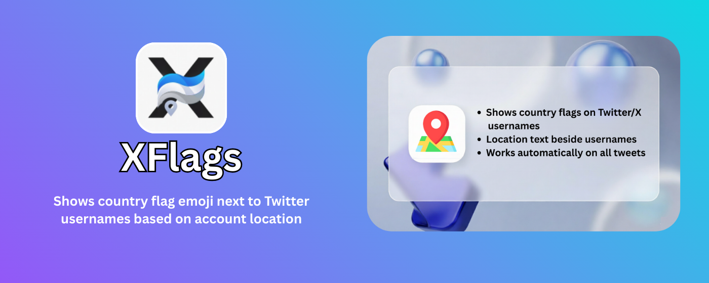

# Twitter Location Flag 🚀

**Twitter Location Flag** is a sleek, privacy-first browser extension that displays country flag emojis next to Twitter (X) usernames based on their account location. Instantly identify where accounts are registered without leaving your timeline.

---
## 🌐 Supported Browsers

| Chrome | Firefox | Brave | Edge | Safari | **Opera** |
|--------|---------|-------|------|--------|-----------|
|  |  |  |  |  |  |

---

## 🌐 Store Installation

---

## 🚀 Manual Installation Process

### Chrome / Edge / Brave
1. Clone or download the repo.
2. Open `chrome://extensions/`.
3. Enable **Developer mode**.
4. Click **Load unpacked**.
5. Select this project folder.

### Firefox
1. Clone or download the repo.
2. Open `about:debugging#/runtime/this-firefox`.
3. Click **Load Temporary Add-on...**.
4. Select `manifest.json`.

---

## ✨ Features

- **Instant Flag Detection**: Automatically displays the corresponding country flag emoji next to usernames on Twitter (X).
- **Infinite Scroll Support**: Works seamlessly with dynamically loaded tweets and profiles.
- **Smart Caching**: Efficiently caches location data to minimize API calls and ensure performance.
- **Native Integration**: Designed to look and feel like a native part of the Twitter UI.
- **Toggle Control**: Easily enable or disable the flag display from the extension popup.
- **Privacy First**: No data is collected or sent to third-party servers; all queries are made directly to Twitter's API.

---

## 📖 Usage

### Viewing Flags
1. Simply browse Twitter (X.com).
2. Flags will automatically appear next to usernames in the timeline, search results, and profiles.

### Toggling the Extension
1. Click the extension icon in the toolbar.
2. Use the toggle switch to enable or disable the flag display.

---

## 🛠️ Technical Details
- **API Mapping**: Uses Twitter's internal GraphQL API to fetch official account location data.
- **Flag Mapping**: Comprehensive mapping of country names to emojis in `countryFlags.js`.
- **Injected Scripts**: Uses memory-safe page script injection to handle secure API requests.

---

## 👨–Credits
Created by **[AcrNischal](https://nishchalacharya.com.np)**.

Check out the code on [GitHub](https://github.com/AcrNischal/TwitterFlag).

---

*Built with Vanilla JS, HTML & CSS. No frameworks needed.*
